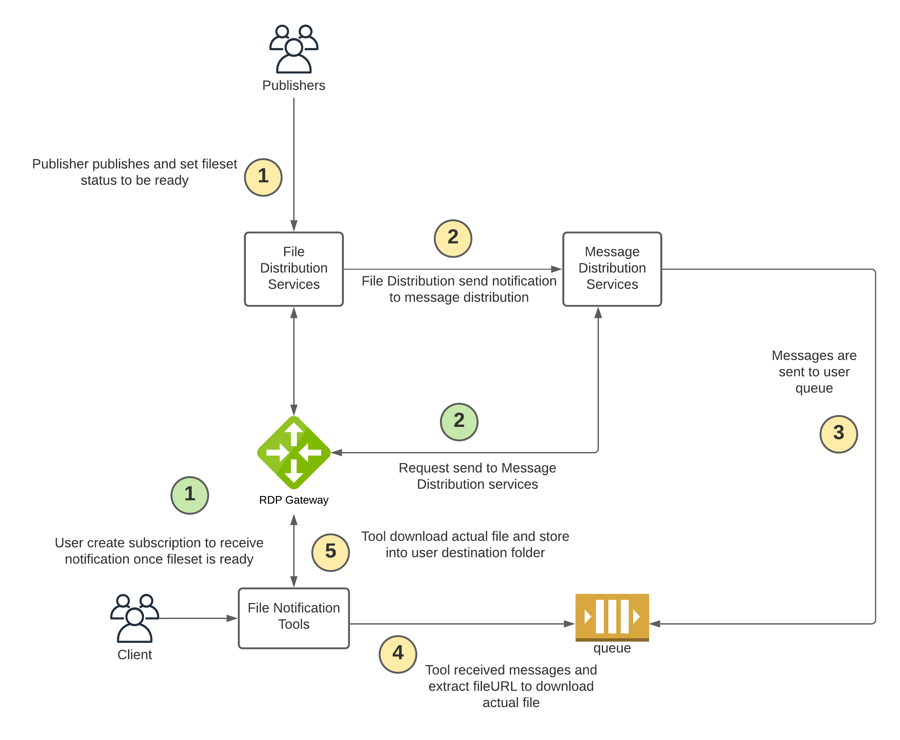

# FileNoti.Message.Distribution.Tools
## Overview



## Setup

1. If you didn't have python3.7 yet please install it via https://www.python.org/ftp/python/3.7.11/Python-3.7.11.tgz
2. Please verify python version before you proceed the next step (Readme file currently support installation python3.7 and python3.9)
   - python --version
3. Run command to install python libraries
   // For python3.7 
      - python3 -m pip install -r python37_libs.txt
   // For python 3.9
      - python3 -m pip install -r python39_libs.txt
4. If you encounter error ModuleNotFoundError: No module named 'Crypto' please follow step below
   // This step is used for python3.7 troubleshooting
   - python -m pip uninstall crypto 
   - python -m pip uninstall pycrypto
   - python -m pip install -r python37_libs.txt
5. **Go to folder name msg_dist_tools** and open file credentials.ini and specify all information (If you don't know information please contact https://developers.refinitiv.com)
6. Run Program please check Tool Description section
7. Messages will be stored under metadata/<subscriptionId> folder
8. FileNoti file will be downloaded into your destination folder

## Tools Description

1. **Help Command**
      ```
      python fileNotiMessages.py -h
      ```

2. **Create a new subscription and specify input json file**
      Syntax
      ```
      python fileNotiMessages.py -c -i requestBody/<json file>
      ```
      Example
      ```
      python fileNotiMessages.py -c -i requestBody/singleBucketFilter.json
      ```
      

3. **Poll message queue from existing subscription and specify destination folder**
      Syntax
      ```
      python fileNotiMessages.py -p -s <subscriptionId> -d <destination folder>
      ```
      Example
      ```
      python fileNotiMessages.py -p -s xxxx-xxxx-xxxx-xxxx -d C:\msg_dist_python_tools\cfs_download
      ```

4. **Get all subscriptions**
      ```
      python fileNotiMessages.py -g
      ```

5. **Get specific subscription**
      Syntax
      ```
      python fileNotiMessages.py -g -s <subscriptionId>
      ```
      Example
      ```
      python fileNotiMessages.py -g -s xxxx-xxxx-xxxx-xxxx
      ```

6. **Update user subscription filter**
      Syntax
      ```
      python fileNotiMessages.py -m -s <subscriptionId> -i requestBody/<json file>
      ```
      Example
      ```
      python fileNotiMessages.py -m -s xxxx-xxxx-xxxx-xxxx -i requestBody/multipleBucketFilter.json
      ```


7. **Delete all subscriptions**
      ```
      python fileNotiMessages.py -u
      ```

8. **Delete specific subscription**
      Syntax
      ```
      python fileNotiMessages.py -u -s <subscriptionId>
      ```
      Example
      ```
      python fileNotiMessages.py -u -s xxxx-xxxx-xxxx-xxxx
      ```

9. **Get NumberOfAvailableMessages in sqs queue**
      Syntax
      ```
      python fileNotiMessages.py -q -s <subscriptionId>
      ```
      Example
      ```
      python fileNotiMessages.py -q -s xxxx-xxxx-xxxx-xxxx
      ```
       
10. **Recovery Failure messages**
      Syntax
      ```
      python fileNotiMessages.py -r -d <destination folder>
      ```
      Example
      ```
      python fileNotiMessages.py -r -d C:\msg_dist_python_tools\cfs_download
      ```

## Failure and Recovery Workflow
- When application encounter connectivity, network or unexpected issue please follow workflow as shown below
   1) Application will create failure messages with file name format <ecpMessageId>_yyyymmdd-HHMMSS_fail.json under "failure" folder
   2) Application will create "error_mapping.csv" if it does not exist and put information below into csv file
      2.1) messageId    --> This is unique id for each messages generated from system
      2.2) totalErrors  --> Total errors will increment by one if client recover the same messages
      2.3) lastUpdate   --> Timestamp will be update once tool update the record
      2.4) bucketName   --> CFS BucketName
      2.5) filesetName  --> CFS FilesetName which is fileset that publisher change status to be ready that it allow client download files
      2.6) fileId       --> CFS FileId which is file that client is downloading (if you see "all", it means there is unexpected error and client will need to recovery all files under that fileset)
      2.7) errorMessage --> This is custom erorr messages from Python tools which is consists of 3 main errors below
           - 2.7.1  "failed to download s3 url"  --> Tool cannot download s3 file from publisher such as file does not exist or no permission
           - 2.7.2  "failed to get s3 presigned url" --> Tool cannot get file stream api from CFS service
           - 2.7.3  "unexpected error, failed to get file stream" --> unexpected error
      2.8) statusCode   --> error status code
      2.9) url          --> presigned url or filestream url
      2.10) response    --> error response
   3) You need to run Step10 from [Tools Description]
   4) If there is no issue with failure messages, failure message will be deleted and record in "error_mapping.csv" will be cleared