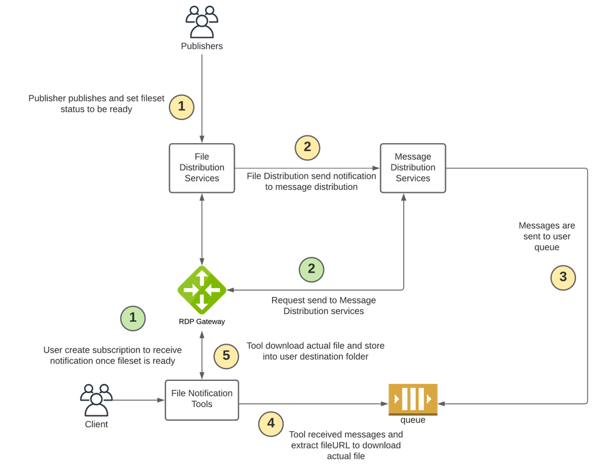

# FileNoti.Message.Distribution.Tools
- version: 1.0.2
- Last update: January 2024
- Environment: Python
- Prerequisite: [Access to RDP credentials](#prerequisite)

## <a id="overview"></a>Overview



## <a id="prerequisite"></a>Prerequisite

There is some prerequisite, dependencies, and libraries that the project is needed.

### Access to the RDP with the your desire CFS file permission

This project uses RDP access credentials with the CFS file permission.

Please contact your LSEG representative to help you with the RDP account and services.

### Internet Access

This demonstration connects to RDP on AWS via a public internet.

### Python

This project uses [Python](https://www.python.org/) programming language and runtime.

## <a id="how_to_run"></a>How to run the application

The first step is to unzip or download the example project folder into a directory of your choice, then set up Python environment based on your preference.

You can download the tool via the following Git command or manual download from the page.

### Download via Git

Firstly, you need to install Git tool on your machine. You can find more detail about how to install Git from the following resources:
* [Git-SCM website](https://git-scm.com/book/en/v2/Getting-Started-Installing-Git).
* [GitHub Desktop website](https://desktop.github.com/).

Once the installation is succeed, please open a Git Bash tool on the prefer folder and run the following command:

```bash
git clone https://github.com/LSEG-API-Samples/FileNoti.Message.Distribution.Tools.git
```
### Manual Download

Please open the [https://github.com/LSEG-API-Samples/FileNoti.Message.Distribution.Tools/tree/main](https://github.com/LSEG-API-Samples/FileNoti.Message.Distribution.Tools/tree/main) URL on your prefer web browser, click on the "Code" button and choose "Download ZIP" option.


## <a id="tool_setup"></a>Tool Setup

1. If you didn't have python3.7 or python 3.9 yet please install it via https://www.python.org/downloads/ website
2. You can follow https://wiki.python.org/moin/BeginnersGuide/Download and https://realpython.com/installing-python/ websites for the installation guides.
3. Please verify python version before you proceed the next step (Readme file currently support installation python3.7 and python3.9)
   
      ```bash
      python --version
      ```   
4. Run command to install python libraries
      // For python3.7 
      ```bash
      python3 -m pip install -r python37_libs.txt
      ```
      // For python 3.9
      ```bash
      python3 -m pip install -r python39_libs.txt
      ```
5. If you encounter error ModuleNotFoundError: No module named 'Crypto' please follow step below
      // This step is used for python3.7 troubleshooting
      ```bash
      python -m pip uninstall crypto 
      python -m pip uninstall pycrypto
      python -m pip install -r python37_libs.txt
      ```
6. **Go to folder name msg_dist_tools** and open file **credentials.ini** and specify your RDP credential information as follows (If you don't know information please contact your LSEG representative)
      ```ini
      [RDP]
      username = <RDP user-id/machine-id>
      password = <RDP password>
      clientId = <RDP App Key>
      ```
7. Run Program please check Tool Description section
8. Messages will be stored under metadata/<subscriptionId> folder
9. FileNoti file will be downloaded into your destination folder

## <a id="tool_run"></a>Tools Running Description

Firstly, you need to set Bucket-name and Package Id (if you have the package Id information) in the json file in the **msg_dist_tools/requestBody** folder.

Example: *singleBucketFilter.json*
```json
{
    "transport": {
        "transportType": "AWS-SQS"
    },
    "query": {
        "bool": {
            "must": [
                {
                    "term": {
                        "payload.FileStoreNotification.fileset.bucketName": "{bucket-name}"
                    }
                },
                {
                    "term": {
                        "payload.FileStoreNotification.fileset.status": "READY"
                    }
                }
            ]
        }
    }
}
```

Example: *singlePackageIdFilter.json*
```json
{
    "transport": {
        "transportType": "AWS-SQS"
    },
    "query": {
        "bool": {
            "must": [
                {
                    "term": {
                        "payload.FileStoreNotification.fileset.packageId": "{package id}"
                    }
                },
                {
                    "term": {
                        "payload.FileStoreNotification.fileset.status": "READY"
                    }
                }
            ]
        }
    }
}
```

Example: *bucketAndPackageIdFilter.json*
```json
{
    "transport": {
        "transportType": "AWS-SQS"
    },
    "query": {
        "bool": {
            "must": [
                {
                    "term": {
                        "payload.FileStoreNotification.fileset.bucketName": "{bucket-name}"
                    }
                },
                {
                    "term": {
                        "payload.FileStoreNotification.fileset.packageId": "{package id}"
                    }
                },
                {
                    "term": {
                        "payload.FileStoreNotification.fileset.status": "READY"
                    }
                }
            ]
        }
    }
}
```

Please contact your LSEG representative about your Bucket-name and Package ID.

The next step is creating a new subscription and specify input json file with the following command:

```bash
python fileNotiMessages.py -c -i requestBody/<json file>
```
Example: I am demonstrating with singleBucketFilter.json and **Test_CFS_BucketTiming** test bucket-name and **4fbb-f1b5-d428da4f-9392-28214215d35a** test package Id as an example data set.

```bash
python fileNotiMessages.py -c -i requestBody/bucketAndPackageIdFilter.json
```
Result:
```bash
log_path log\app.log, log_dir log
log_path log\error.log, log_dir log
Program is started
\ 2024-01-18 18:04:20,861 INFO Successfully get current user: {user}
2024-01-18 18:04:20,861 INFO input parameter = {'get': False, 'create': True, 'poll': False, 'modify': False, 'delete': False, 'subscriptionId': None, 'input': 'requestBody/bucketAndPackageIdFilter.json', 'destinationFolder': None, 'queue': False, 'recovery': False}
2024-01-18 18:04:20,861 INFO

2024-01-18 18:04:20,861 INFO *************************************************************************
2024-01-18 18:04:20,861 INFO ******************* Create new subscription *****************************
2024-01-18 18:04:20,861 INFO *************************************************************************
2024-01-18 18:04:20,861 INFO Request URL: https://api.refinitiv.com/message-services/v1/file-store/subscriptions
2024-01-18 18:04:20,877 INFO Request Body: {'transport': {'transportType': 'AWS-SQS'}, 'query': {'bool': {'must': [{'term': {'payload.FileStoreNotification.fileset.bucketName': 'Test_CFS_BucketTiming'}}, {'term': {'payload.FileStoreNotification.fileset.packageId': '4000-04ea-7d282653-8e6d-810dda18956d'}}, {'term': {'payload.FileStoreNotification.fileset.status': 'READY'}}]}}}
/ 2024-01-18 18:04:22,912 INFO -------------------- Successfully create subscription ----------------------
2024-01-18 18:04:22,928 INFO subscriptionID: b6447a1a-da72-4fbd-b2f5-96185d72eb21
2024-01-18 18:04:22,928 INFO transportEndpoint: https://sqs.us-east-1.amazonaws.com/642157181326/sqs-edsalerts-main-prod-usersqs-b6447a1a-da72-4fbd-b2f5-96185d72eb21
2024-01-18 18:04:22,928 INFO cryptographyKey: iT4kQg+7eQnYhphLN8FbxrfeTXHLGKo0dbHapGm32pQ=
2024-01-18 18:04:22,928 INFO query: {'bool': {'must': [{'term': {'payload.FileStoreNotification.fileset.bucketName': 'Test_CFS_BucketTiming'}}, {'term': {'payload.FileStoreNotification.fileset.packageId': '4000-04ea-7d282653-8e6d-810dda18956d'}}, {'term': {'payload.FileStoreNotification.fileset.status': 'READY'}}]}}
```

The information you need is the **subscriptionID** in the log above. Please copy it for further use.

The next step is polling message queue from existing subscription and specify destination folder using the **subscriptionID** above.

```bash
python fileNotiMessages.py -p -s <subscriptionId> -d <destination folder>
```
Example: 
```bash
python fileNotiMessages.py -p -s b6447a1a-da72-4fbd-b2f5-96185d72eb21 -d C:\msg_dist_python_tools\cfs_download
```

If you want to change the Bucket-name or Package Id, you can update the current **subscriptionID** with the updated JSON file like the following example:


```bash
python fileNotiMessages.py -m -s b6447a1a-da72-4fbd-b2f5-96185d72eb21 -i requestBody/multipleBucketFilter.json
```

**Caution**: If you still want a CFS file, please keep the **subscriptionID** (and update it if you want to change something) until you really want to stop download the CFS file.

If you want to stop download the CFS file, you can delete the subscriptions with the following command:

```bash
python fileNotiMessages.py -u
```
## <a id="tool_commands"></a>List of supported commands

1. **Help Command**
      ```bash
      python fileNotiMessages.py -h
      ```

2. **Create a new subscription and specify input json file**
      Syntax
      ```bash
      python fileNotiMessages.py -c -i requestBody/<json file>
      ```
      Example
      ```bash
      python fileNotiMessages.py -c -i requestBody/singleBucketFilter.json
      ```

3. **Poll message queue from existing subscription and specify destination folder**
      Syntax
      ```bash
      python fileNotiMessages.py -p -s <subscriptionId> -d <destination folder>
      ```
      Example
      ```bash
      python fileNotiMessages.py -p -s xxxx-xxxx-xxxx-xxxx -d C:\msg_dist_python_tools\cfs_download
      ```

4. **Get all subscriptions**
      ```bash
      python fileNotiMessages.py -g
      ```

5. **Get specific subscription**
      Syntax
      ```bash
      python fileNotiMessages.py -g -s <subscriptionId>
      ```
      Example
      ```bash
      python fileNotiMessages.py -g -s xxxx-xxxx-xxxx-xxxx
      ```

6. **Update user subscription filter**
      Syntax
      ```bash
      python fileNotiMessages.py -m -s <subscriptionId> -i requestBody/<json file>
      ```
      Example
      ```bash
      python fileNotiMessages.py -m -s xxxx-xxxx-xxxx-xxxx -i requestBody/multipleBucketFilter.json
      ```


7. **Delete all subscriptions**
      ```bash
      python fileNotiMessages.py -u
      ```

8. **Delete specific subscription**
      Syntax
      ```bash
      python fileNotiMessages.py -u -s <subscriptionId>
      ```
      Example
      ```bash
      python fileNotiMessages.py -u -s xxxx-xxxx-xxxx-xxxx
      ```

9. **Get NumberOfAvailableMessages in sqs queue**
      Syntax
      ```bash
      python fileNotiMessages.py -q -s <subscriptionId>
      ```
      Example
      ```bash
      python fileNotiMessages.py -q -s xxxx-xxxx-xxxx-xxxx
      ```
       
10. **Recovery Failure messages**
      Syntax
      ```bash
      python fileNotiMessages.py -r -d <destination folder>
      ```
      Example
      ```bash
      python fileNotiMessages.py -r -d C:\msg_dist_python_tools\cfs_download
      ```

## Failure and Recovery Workflow
- When application encounter connectivity, network or unexpected issue please follow workflow as shown below
   1) Application will create failure messages with file name format <ecpMessageId>_yyyymmdd-HHMMSS_fail.json under "failure" folder
   2) Application will create "error_mapping.csv" if it does not exist and put information below into csv file
      2.1) messageId    --> This is unique id for each messages generated from system
      2.2) totalErrors  --> Total errors will increment by one if client recover the same messages
      2.3) lastUpdate   --> Timestamp will be update once tool update the record
      2.4) bucketName   --> CFS BucketName
      2.5) filesetName  --> CFS FilesetName which is fileset that publisher change status to be ready that it allow client download files
      2.6) fileId       --> CFS FileId which is file that client is downloading (if you see "all", it means there is unexpected error and client will need to recovery all files under that fileset)
      2.7) errorMessage --> This is custom erorr messages from Python tools which is consists of 3 main errors below
           - 2.7.1  "failed to download s3 url"  --> Tool cannot download s3 file from publisher such as file does not exist or no permission
           - 2.7.2  "failed to get s3 presigned url" --> Tool cannot get file stream api from CFS service
           - 2.7.3  "unexpected error, failed to get file stream" --> unexpected error
      2.8) statusCode   --> error status code
      2.9) url          --> presigned url or filestream url
      2.10) response    --> error response
   3) You need to run Step10 from [Tools Description]
   4) If there is no issue with failure messages, failure message will be deleted and record in "error_mapping.csv" will be cleared

## <a id="troubleshooting"></a>Troubleshooting

**Error**: "'pip' is not recognized as an internal or external command, operable program or batch file." when run a "python3 -m pip install" command.

**Answer**: Your Python installation is not completed. You need to add the path of the pip installation (**{Python installation folder}\Scripts** folder by default) to your PATH system variable. For more detail, please check the following resources:
- https://stackoverflow.com/questions/23708898/pip-is-not-recognized-as-an-internal-or-external-command
- https://builtin.com/software-engineering-perspectives/pip-command-not-found
- https://discuss.python.org/t/pip-not-working/30102

**Error**: "Failed to get access token 400 - {"error":"access_denied"  ,"error_description":"Invalid username or password." }" when running the tool.

**Answer**: This error message means your RDP username or password information in the **msg_dist_tools/credentials.ini** is invalid. Please verify your RDP username (user-id/machine-id) and password.

**Error**: "Failed to get access token 401 - {"error":"invalid_client"  ,"error_description":"Invalid Application Credential." }" when running the tool.

**Answer**: This error message means your RDP App Key information in the **msg_dist_tools/credentials.ini** is invalid. Please verify your RDP App Key.

**Error**: Error with "{"status":403,"message":"Access denied: Insufficient claims to access this resource"}" when running the tool.

**Answer**: This error message means your RDP account does not have permission to access the RDP CFS API for your desire bucket. Please contact your LSEG representative to verify your permission.


## <a id="references"></a>References

* Refinitiv Data Platform APIs page: https://developers.lseg.com/en/api-catalog/refinitiv-data-platform/refinitiv-data-platform-apis
* Refinitiv Developer Community: https://developers.lseg.com/ website.
* Refinitiv Data Platform APIs Playground page: https://apidocs.refinitiv.com/Apps/ApiDocs

For any questions related to Refinitiv Data Platform APIs, please use the Developers Community Q&A page: https://community.developers.refinitiv.com/ website.